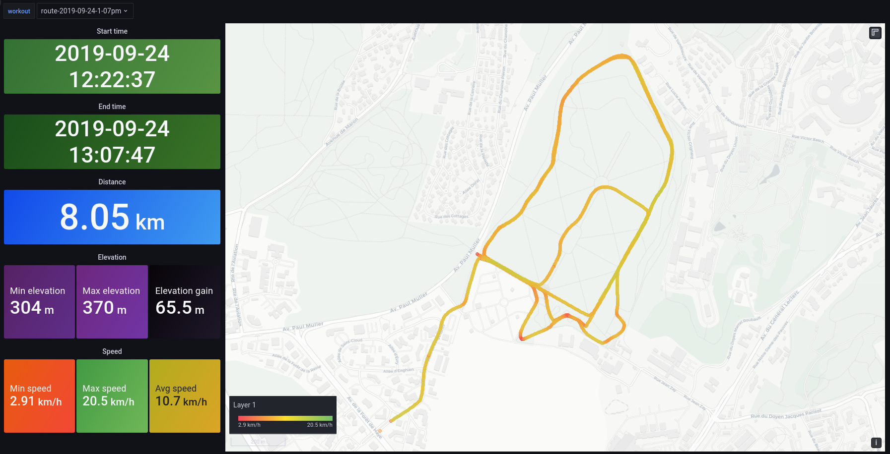

# Apple Health Grafana

Tool to import your Apple Health Data in Influx and visualize them in Grafana.




## Export your Apple health Data

From [support.apple.com](https://support.apple.com/guide/iphone/share-your-health-data-iph5ede58c3d/ios):
```
Share your health and fitness data in XML format

You can export all of your health and fitness data from Health in XML format, which is a common format for sharing data between apps.

    Tap your profile picture or initials at the top right.

    If you don’t see your profile picture or initials, tap Summary or Browse at the bottom of the screen, then scroll to the top of the screen.

    Tap Export all health data, then choose a method for sharing your data.
```

This will create a .zip file that can be shared from the iPhone via Airdrop, messages, mail and so on.

Once you've copied/shared the file to your computer, note the path of the file (can be something like /home/me/downloads/export.zip)

## Launching the stack

You'll need docker and docker-compose installed.

Clone the repo:

```sh
git clone https://github.com/k0rventen/apple-health-grafana.git
```

Change the following line in the `docker-compose.yml`:

```yaml
    volumes:
    - <local_path_to_export.zip>:/export.zip
```

by replacing the `<local_path_to_export.zip>` with your actual health data export file path from the previous step, eg __/home/me/downloads/export.zip__:

```yaml
    volumes:
    - /home/me/downloads/export.zip:/export.zip
```

you can also use a relative path (assuming you are in the same directory as the compose file):
```yaml
    volumes:
    - ./export.zip:/export.zip
```

Then simply run:

```
# download or upgrade the images (especially if you've already used the project)
docker-compose pull

# start grafana and influx in the background
docker-compose up -d grafana influx

# start our ingester
docker-compose up ingester
```


You should see some logs from the ingester container:
```
apple-health-grafana-ingester-1  | unzipping the export file..
apple-health-grafana-ingester-1  | export file unzipped
apple-health-grafana-ingester-1  | influx is ready
apple-health-grafana-ingester-1  | loading workout routes
apple-health-grafana-ingester-1  | opening Route 2022-01-16 4:19pm
...
apple-health-grafana-ingester-1  | inserted 1940000 records
apple-health-grafana-ingester-1  | Total number of records: 1942310
apple-health-grafana-ingester-1  | All done ! You can now check grafana.
apple-health-grafana-ingester-1 exited with code 0
```

Wait for a log saying that all the data have been imported.

_Note: Depending on the amount of data the export has, it can take a few minutes to work through. As an example, loading nearly 3 years of data (2 millions+ data points, 200+ workout routes) on a 10th gen i5 took 2 minutes and around 11 minutes on a Raspberry Pi 4._


## Visualization and next steps

Head to __http://localhost:3000__, and login with the grafana credentials from the compose file (defaults to `admin`:`health`).

Three dashboards are created by default:
- **Apple Health:** a generic one displaying every metric available
- **Apple Health Specific Metrics:** a more refined one for specific metrics (incl. workouts, heart rate, etc.)
- **Workout Routes:** displays a GPS map of your outdoor workout routes (walking/running/biking)
